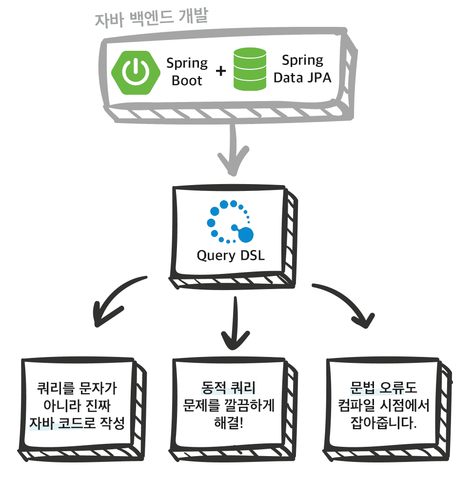

# jpa-querydsl   

</img>

최신 자바 백엔드는 주로 스프링 부트와 JPA, 스프링 데이터 JPA를 조합해서 사용합니다. 그런데 이런 조합으로 해결하지 못하는 한계점이 바로 **복잡한 쿼리**와 **동적 쿼리** 문제입니다.

실무에서는 보통 복잡한 쿼리를 다루고, 여기에 더해서 동적 쿼리를 사용할 일도 많습니다. 비즈니스 도메인에 따라서 쿼리를 작성하는 일이 개발 업무의 절반 이상인 경우도 있습니다. 이러한 문제들을 **깔끔하게 해결해주는 기술이 바로 Querydsl** 입니다.

Querydsl은 자바 언어의 한계를 넘어서, **쿼리를 문자가 아니라 진짜 자바 코드로 작성**할 수 있게 도와줍니다. 정말 많은 개발자들이 고민해온 **동적 쿼리 문제를 깔끔하게 해결**할 뿐만 아니라, **문법 오류도 컴파일 시점**에 모두 잡아줍니다. 자바코드로 작성하지만 SQL, JPQL과 문법이 거의 같기 때문에 쉽게 학습할 수 있고, 또 쉽게 복잡한 쿼리도 작성할 수 있습니다.

스프링 부트와 JPA라는 기반 위에, 스프링 데이터 JPA와 Querydsl이라는 두 환상적인 프레임워크를 더하면 개발이 정말 즐거워집니다. 지금까지 조금이라도 단순하고 반복이라 생각했던 개발 코드들이 확연히 줄어듭니다. 개발자는 핵심 비즈니스 로직을 개발하는데, 집중할 수 있습니다. 그리고 Querydsl 덕분에 쿼리를 작성하는 것 조차도 자바 코드로 작성할 수 있어서 즐겁습니다. **복잡한 실무에서 스프링 데이터 JPA와 Querydsl의 조합은 선택이 아니라 필수**입니다.

## 학습 목차

#### 1. [Querydsl 설정](https://www.notion.so/121c4a29ffa742a6b144621a93ef5ae3)
#### 2. [기본 문법](https://www.notion.so/ad29fbf87fe248a7bc1a3af09138273d)
#### 3. [중급 문법](https://www.notion.so/285c6c1ebba341209a7b842c379a1b71)
#### 4. [실무 활용 - 순수 JPA와 Querydsl](https://www.notion.so/JPA-Querydsl-af32aa5a13a64f26bcda0c3b5bec5458)
#### 5. [실무 활용 - 스프링 데이터 JPA와 Querydsl](https://www.notion.so/JPA-Querydsl-8da79ae93c2442e5a96f70aa966c3ac7)

해당 repo는 [실전! Querydsl - 김영한](https://www.inflearn.com/course/Querydsl-%EC%8B%A4%EC%A0%84) 해당 강의를 듣고 정리한 REPO 입니다.
